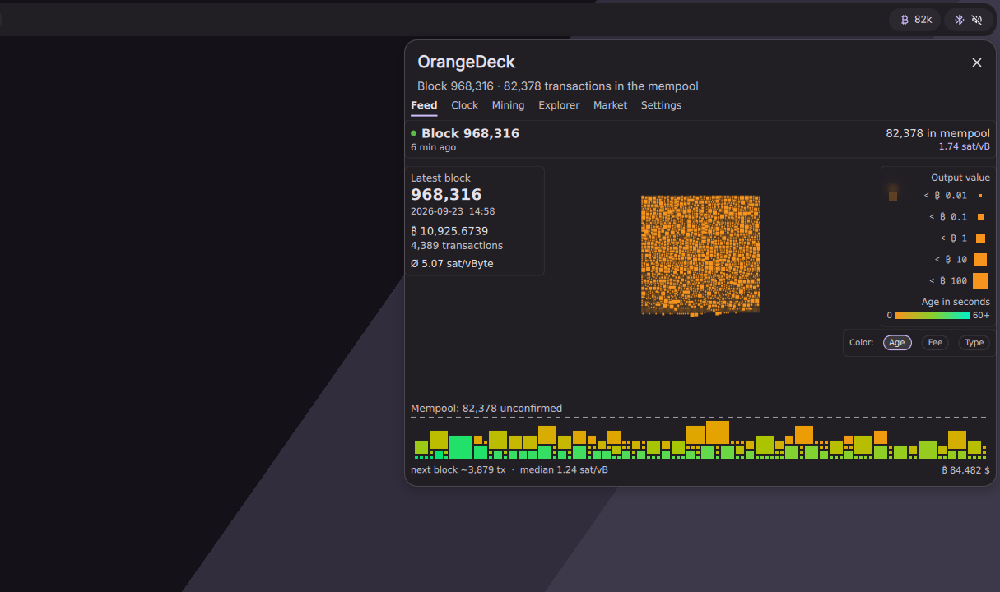

# OrangeDeck for DankMaterialShell

A live view of the Bitcoin mempool as a DMS plugin: the latest block in the
middle, the mempool as a pile below it, new transactions raining in from
above. Besides the mempool feed there are a block clock, a miner view, a
market view and a block explorer.



It runs in three places at once:

- a bar pill with the current mempool count, click for the popout,
- a control center tile with the same views,
- a desktop widget, one instance per view, freely placed and sized.

## Requirements

- DankMaterialShell 1.5.0 or newer
- `QtWebSockets` (Qt 6). Without it the market view hides itself; everything
  else keeps working.

Nothing else. The plugin talks to `mempool.space` by itself.

## Install

From the plugin registry:

```sh
dms plugins install orangedeck
dms ipc call plugins enable orangedeck
```

It is also listed in DMS under Settings → Plugins → Browse. To install from the repository instead:

```sh
git clone https://github.com/orangedeck-dev/dms-plugin ~/.config/DankMaterialShell/plugins/OrangeDeck
dms ipc call plugins enable orangedeck
```

## Data source

Data comes either straight from `mempool.space` or from the OrangeDeck
service, a small local daemon that is part of the full
[OrangeDeck](https://orangedeck.dev) application. The setting "Data source"
is on "Automatic": the plugin asks the service once, and if nothing answers
within a few seconds it fetches everything itself.

The service is optional. It is worth having when several windows or widgets
are open, because it keeps one connection instead of one per view, and it is
the only way to get the wallet view: deriving addresses from an xpub stays
in the service, so that tab is hidden without it. The miner view works either
way once the device address is entered.

## Settings

Every view has its own settings, reachable from the plugin settings page in
DMS. The language follows the one set in DMS unless you pick another (13 languages),
currency defaults to USD.

## License

MIT, see `LICENSE`. Two files, `mondrian.js` and `colors.js`, are ports from
[bitfeed](https://github.com/bitfeed-project/bitfeed) and carry a note in
their headers; bitfeed is MIT as well, see `LICENSE-bitfeed`.

Parts of this plugin were written with help from Claude (Anthropic). I read the
code and tested every change on my own desktop.
