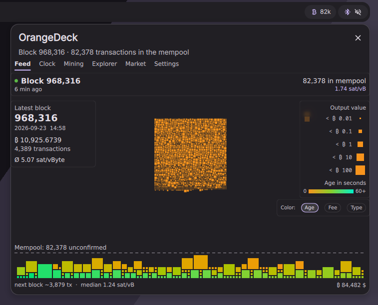
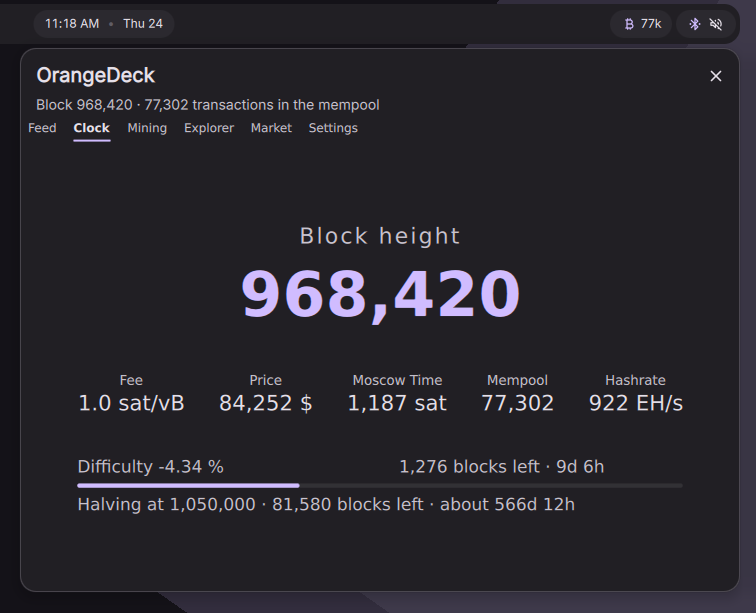
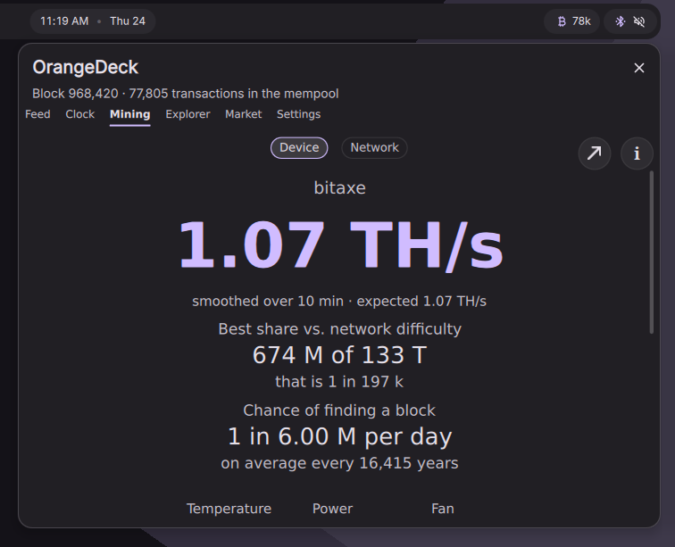
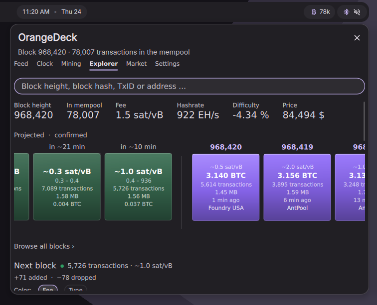
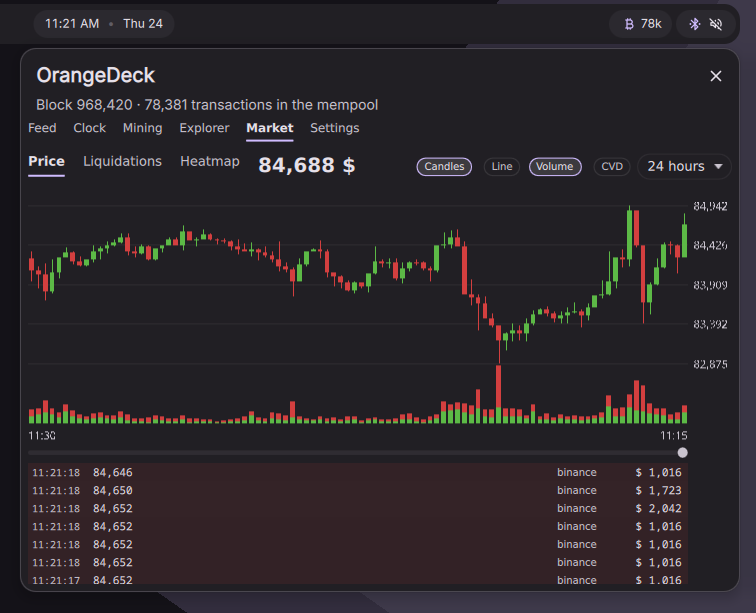
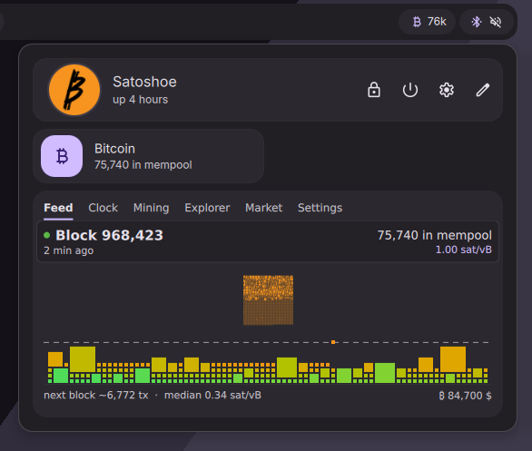
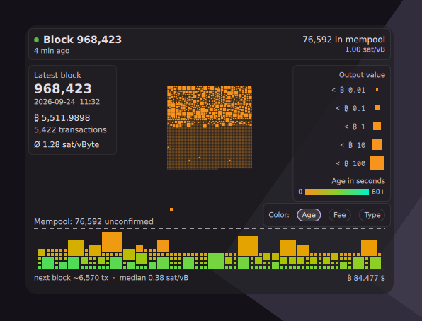

# OrangeDeck for DankMaterialShell

A live view of the Bitcoin mempool as a DMS plugin: the latest block in the
middle, the mempool as a pile below it, new transactions raining in from
above. Besides the mempool feed there are a block clock, a miner view, a
market view and a block explorer.



It runs in three places at once:

- a bar pill with the current mempool count, click for the popout,
- a control center tile with the same views,
- a desktop widget, one instance per view, freely placed and sized.

## Screenshots

| | |
|---|---|
|  |  |
| Block clock: height, fees, price, difficulty and the next halving | Miner view: hashrate, best share and the chance of finding a block |
|  |  |
| Explorer: projected and confirmed blocks, search by height, hash, TxID or address | Market: price chart with volume, liquidations, heatmap and live trades |
|  |  |
| The control center tile opened on the feed | The feed as a desktop widget |

## Requirements

- DankMaterialShell 1.5.0 or newer
- `QtWebSockets` (Qt 6), packaged as `qt6-websockets` on Arch. Without it
  the plugin can only show data from the OrangeDeck service (see below): the
  direct connection to the mempool instance and the market view need it.

Nothing else. The plugin talks to `mempool.space` by itself, or to another
mempool instance you set in its settings.

## Network access

- The mempool instance from the settings, `mempool.space` by default: REST
  requests and one WebSocket.
- While the market view is open: `api.binance.com`, `fapi.binance.com`,
  `www.okx.com`, `ws.okx.com`, `api.bybit.com` and `stream.bybit.com`.
- The miner addresses you enter, on your own network.
- `127.0.0.1:21021`, the optional OrangeDeck service. At startup the plugin
  runs `systemctl --user start orangedeck.service`, or `~/.local/bin/orangedeck`
  if that exists. Installed from the registry neither is there, and nothing
  is started.

## Install

From the plugin registry:

```sh
dms plugins install orangedeck
dms ipc call plugins enable orangedeck
```

It is also listed in DMS under Settings → Plugins → Browse. To install from the repository instead:

```sh
git clone https://github.com/orangedeck-dev/dms-plugin ~/.config/DankMaterialShell/plugins/OrangeDeck
dms ipc call plugins enable orangedeck
```

## Data source

Data comes either straight from `mempool.space` or from the OrangeDeck
service, a small local daemon that is part of the full
[OrangeDeck](https://orangedeck.dev) application. The setting "Data source"
is on "Automatic": the plugin asks the service once, and if nothing answers
within a few seconds it fetches everything itself.

"Mempool instance" in the general settings chooses where the data comes from:
empty for `mempool.space`, another public instance such as `mempool.emzy.de`,
or your own node, for example `http://umbrel.local:3006`. It applies in direct
mode and is passed on to the OrangeDeck service on the same computer.

The service is optional. It is worth having when several windows or widgets
are open, because it keeps one connection instead of one per view. The miner
view works either way once the device address is entered.

## Settings

Every view has its own settings, reachable from the plugin settings page in
DMS. The language follows the one set in DMS unless you pick another (13 languages),
currency defaults to USD.

## Donate

OrangeDeck is free. If you would like to support the work on it:
**[orangedeck.dev/en/donate](https://orangedeck.dev/en/donate/)**, over
Lightning (BOLT12), Silent Payments or a fresh on-chain address. Wallets with
BIP353 find everything through `₿sats@orangedeck.dev`.

## License

MIT, see `LICENSE`. Two files, `mondrian.js` and `colors.js`, are ports from
[bitfeed](https://github.com/bitfeed-project/bitfeed) and carry a note in
their headers; bitfeed is MIT as well, see `LICENSE-bitfeed`.

Parts of this plugin were written with help from Claude (Anthropic). I read the
code and tested every change on my own desktop.
